# Auditoría UI/UX end-to-end — Zaldo

**Fecha:** 2026-09-25 · **Entorno:** `localhost:5173` (Vite dev) con la cuenta de prueba · **Navegador:** Chromium (Playwright 1.63)
**Viewports:** móvil 390×844 (y 375×667 en login), tablet 768×1024, escritorio 1440×900
**Alcance:** todas las rutas (`/`, `/home`, `/cuentas`, `/movimientos`, `/ingresos`, `/prestamos`, `/cobranza`, `/ahorros`, `/despensa`, `/perfil`), el menú superior, el drawer y todos los modales que se pueden abrir desde ellas.
**Método:** 4 agentes en paralelo, cada uno con un grupo de rutas. Todos trabajaron en modo solo lectura (abrieron modales, pestañas y menús sin guardar nada), tomaron unas 270 capturas y las revisaron visualmente, además de medir en el DOM (scroll horizontal, desbordes, áreas táctiles y consola) y leer el código fuente.

> Efectos colaterales de la auditoría: al navegar al año 2027 en `/ingresos`, la app creó probablemente un documento vacío de ingresos para 2027. Esto viene del comportamiento actual de `obtenerOAInicializarIngresosAnio`, que crea el año con solo consultarlo (ver L-6). No se perdió ni modificó ningún dato existente.

Las capturas citadas están en [`capturas/`](capturas/).

---

## 1. Resumen ejecutivo

- **Responsive:** la base es sólida. Salvo `/prestamos` a 768 px, ninguna ruta tiene scroll horizontal de página. Los modales se abren como hoja inferior en móvil y cierran con Escape. Los problemas se repiten en cuatro patrones:
  1. tablas anchas que en móvil esconden justo la columna importante (monto, saldo, total);
  2. áreas táctiles menores de 40 px en casi toda la app;
  3. barras de pestañas o chips que se cortan sin pista de scroll;
  4. modales sin manejo de foco.
- **Lógica:** aquí están los hallazgos graves. Hay cálculos que muestran cifras incorrectas (gastos inflados, totales incoherentes entre pantallas, porcentajes de 100 % falsos), datos que se pierden en silencio (nota del abono, categoría del movimiento, comida borrada al pulsar "Cancelar") y **migraciones o datos personales fijos en el código** que se ejecutan para cualquier admin y pueden reescribir datos.
- **Riesgo de despliegue:** git registra `componentes/Modales/ModalGenerico.jsx`, pero 21 archivos lo importan como `modales/modalGenerico`. Funciona en Windows; en un build en Linux (Vercel/CI) puede fallar.

### Top 12 por prioridad

| # | Sev. | Área | Problema | Ref. |
|---|---|---|---|---|
| 1 | 🔴 | Movimientos | Los ajustes de saldo, transferencias y pagos de tarjeta pierden su categoría y se cuentan como **gasto** (septiembre muestra $129,972 de "gastos" que son ajustes). Al guardar, la categoría se borra para siempre | L-1 |
| 2 | 🔴 | Ingresos / Préstamos / Despensa | Migraciones y datos personales fijos por email o `admin` se ejecutan en el render y pueden reescribir o duplicar datos (histórico de ingresos, préstamos semilla, atún y precios fijos) | L-2 |
| 3 | 🔴 | Ingresos | El importador abre por defecto en "Cargar histórico (1 clic)", que inyecta los pagos personales de Luis en **cualquier** cuenta sin confirmar | UI-ING-2 |
| 4 | 🔴 | Préstamos | La nota del abono no se guarda; editar u ocultar un préstamo no refresca la tabla (la prop tiene otro nombre) | L-9, L-10 |
| 5 | 🔴 | Global | Fechas por defecto en UTC: después de las 18:00 los formularios proponen **mañana**, y los recordatorios salen con un día de diferencia | L-5 |
| 6 | 🔴 | Ahorros / Movimientos | `styled(SelectVisual)` recibe `options` vacío por el `shouldForwardProp` global: "Más análisis", la categoría de incremento, compras planeadas y recurrentes quedan inutilizables | UI-AHO-1 |
| 7 | 🔴 | Home | Activos y Pasivos difieren en $600 entre Home y el modal de movimiento. `/cuentas` muestra saldos negativos como positivos | UI-HOME-2, UI-CTA-1 |
| 8 | 🔴 | Perfil | Al recargar `/perfil`, Google y Correo aparecen "Sin vincular" aunque lo estén | UI-PER-1 |
| 9 | 🔴 | Despensa | Borrar una comida ignora "Cancelar" | L-3 |
| 10 | 🔴 | Ingresos | "Exportar Matriz Resumen (CSV)" del modal Datos falla (`empresas.map is not a function`) | UI-ING-1 |
| 11 | 🟠 | Móvil | En móvil, las tablas de movimientos, ingresos y préstamos esconden monto, total y saldo; el login en modo registro corta el botón inferior | UI-MOV-1, UI-PRE-2, UI-LOG-1 |
| 12 | 🟠 | Build | Imports con mayúsculas distintas a las del archivo (riesgo en Linux) | T-1 |

---

## 2. Patrones transversales (arreglar una vez, beneficia a toda la app)

| Patrón | Dónde se vio | Propuesta |
|---|---|---|
| **Áreas táctiles < 40 px** | Botón cerrar de modales (30×30), ⋮ de empresas (19×19), campana de despensa (28×28), flechas de mes/año (28–32), casillas de 16–18 px, botones de fila en préstamos (28×28), filtros y chips (22–30 px de alto) | Token `--tap-min: 44px` y `min-height/min-width` en ≤720 px para `button`, chips e íconos; ampliar el área con `padding` o `::after` sin cambiar el tamaño visual |
| **Tablas anchas en móvil** | Registro de movimientos, matriz y pestaña de empresa en ingresos, préstamos (1120 px), cuentas de ahorros | En ≤900 px, cambiar a lista de tarjetas (ya existe `CardNotaDeuda` modo tarjeta) o fijar con sticky la primera columna y la de total; indicar el scroll con fade lateral |
| **Pestañas o chips cortados sin pista** | Pestañas de empresas, filtros de movimientos, áreas de despensa, pestañas del importador | Componente `ScrollChips` con fade en los bordes y scroll-snap |
| **Foco en modales** | `ModalGenerico` no mueve el foco al abrir, no lo atrapa, no lo devuelve y no tiene `aria-labelledby`; en el modal de movimiento, 25 de 25 Tab navegaron por la página de atrás | Focus-trap en `ModalGenerico` (un solo archivo corrige todos los modales), `aria-labelledby` al título, devolver el foco al disparador |
| **Cierre accidental con datos** | El clic en el fondo o Escape descarta formularios largos (Modificar tarjeta, Movimiento, Desglose de incremento) | Si el formulario de Formik está `dirty`, confirmar antes de cerrar |
| **Estado vacío falso mientras carga** | Movimientos ("0 movimientos · $0.00"), KPIs de ingresos en $0, préstamos y despensa cuando falla la carga | `loading=true` inicial, skeletons, y distinguir "cargando", "error (Reintentar)", "vacío" y "sin coincidencias con el filtro" |
| **`div` con onClick** | Tarjetas de Súper/Gastar, historial de comidas, toggle de analítica, tarjetas del modal Datos, título del menú superior, X de buscadores | `button` o `role="button"` + `tabIndex=0` + Enter/Espacio |
| **Selects sin label** | `SelectForm` ignora la prop `label` (`formulariosV1.jsx:300`): Agregar cuenta, Modal empresa, Editar préstamo | Renderizar el `label` en `SelectForm` (arregla todos los formularios) |
| **Props no transitorias al DOM** | `isOpen` (`menuSecundarioLateral.jsx:257-279`), `enPositivo` (`cardCuentaTarjeta.jsx:258`) | Renombrar a `$isOpen` y `$enPositivo` |
| **Avisos de consola** | React Router v7 future flags en todas las rutas; `<svg width="auto">` ×17 en `/cuentas` (`cardCuentaTarjeta.jsx:20`); DataGrid "parent has empty width" a 768 | Activar los future flags, quitar `width="auto"` y dar ancho al contenedor del DataGrid |

---

## 3. Hallazgos por ruta

Severidad: 🔴 Alta · 🟠 Media · 🟡 Baja

### 3.1 Login `/`

- **UI-LOG-1 🔴 · 390 y 375×667 · El modo "Crear cuenta" corta el botón inferior.** La tarjeta usa `position:absolute; top:40%` y el contenedor tiene `overflow:hidden; height:100dvh`. "Ya tengo una cuenta" termina en y=874 con un viewport de 844 y no se puede hacer scroll. `loginUx.jsx:52-56`, `login/index.jsx`. → Flex en columna, `min-height:100dvh`, `overflow-y:auto`. 
- **UI-LOG-2 🟡** Los inputs no tienen `<label>` ni `aria-label`. Los errores no tienen `role="alert"`. No aparece la marca "Zaldo". Mientras se verifica la sesión se ve un panel en blanco (`loading ? <></>`). Quedan unos 330 px vacíos arriba en modo login. 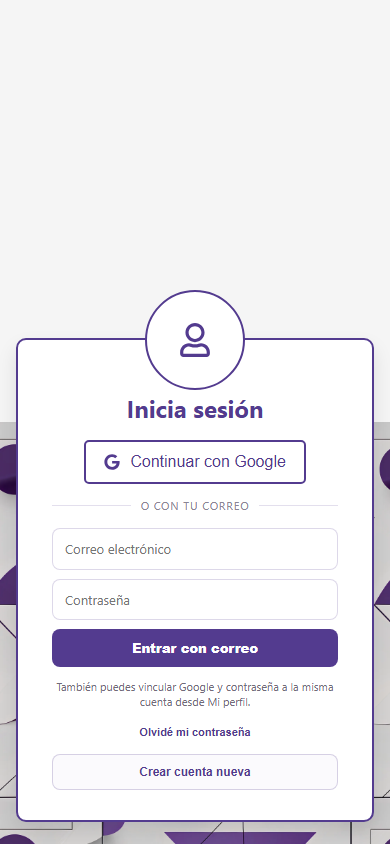

### 3.2 Menú superior y drawer

- **UI-NAV-1 🟠** El drawer no incluye **Inicio** ni **Cobranza**. Volver a `/home` requiere un long-press de 600 ms sobre el saludo, y tocar el título lleva a `/ahorros`, lo que no se puede descubrir. El título es un `div`, así que no se alcanza con teclado. `menuSecundarioLateral.jsx:446-457`, `menuTop/index.jsx:195-205`. 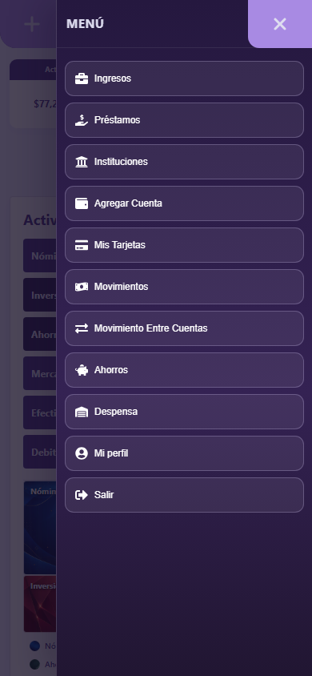
- **UI-NAV-2 🟡** Siempre dice "Buenos Dias" (sin tilde, a cualquier hora). → Saludo según la hora.
- **UI-NAV-3 🟡** "Salir" cierra sesión sin confirmar y recarga toda la página (`menuSecundarioLateral.jsx:391-395`).

### 3.3 Home `/home`

- **UI-HOME-2 🔴 · Totales incoherentes.** Home muestra Activos $77,250 y Pasivos −$70,420.50; el modal de movimiento muestra $77,850 y −$71,020.50. La diferencia de $600 es la cuenta "Efectivo" con saldo negativo: `SeccionResumenes.jsx:79-102` la resta de Activos, mientras que `SeccionCuentas` y el modal la ponen en Pasivos. → Una sola función `clasificarSaldo(cuenta)` compartida. 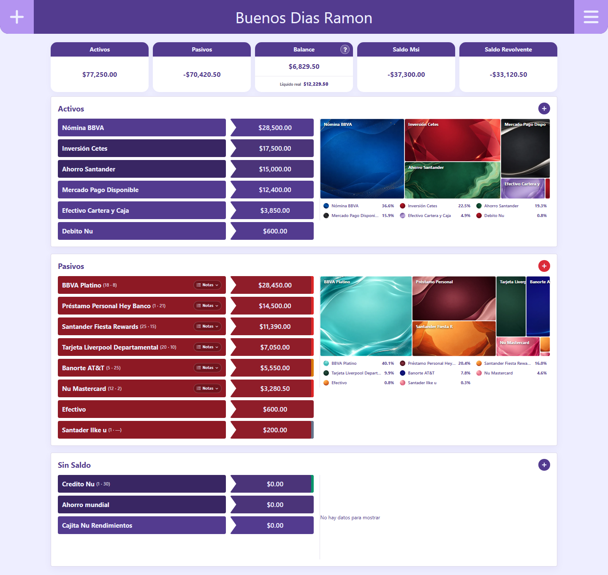 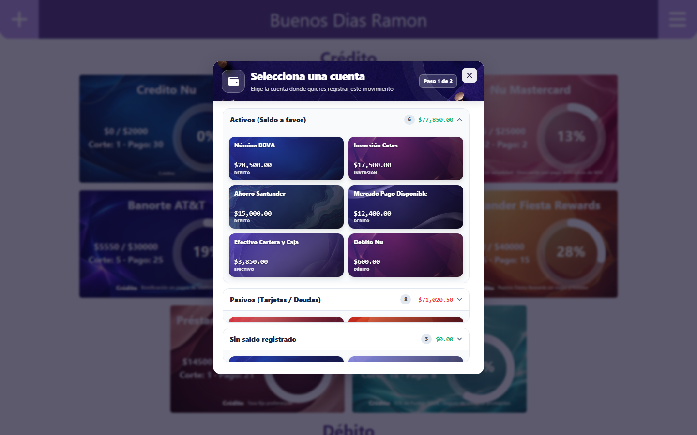
- **UI-HOME-3 🟠 · Balance con doble conteo latente.** En `SeccionResumenes.jsx:86-93`, una tarjeta de crédito con saldo a favor se suma a Activos **y** a Pasivos. Hoy no se nota, pero inflará el Balance cuando se sobrepague una tarjeta.
- **UI-HOME-4 🟠 · 390/768** Los nombres de Pasivos se cortan ("Préstamo Personal H") porque el chip "Notas" ocupa el espacio, y la fecha "(1 · 21)" se parte en dos líneas. 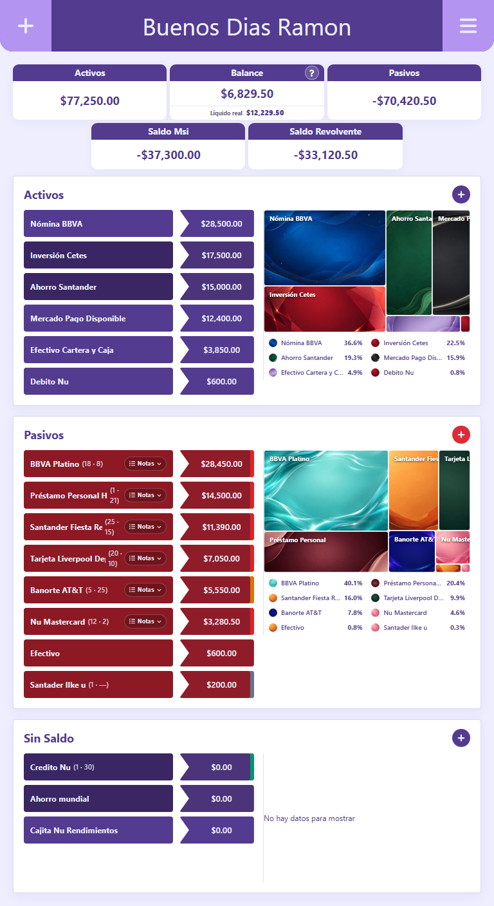
- **UI-HOME-5 🟠** La sección "Sin saldo" renderiza un treemap vacío de unos 200 px ("No hay datos para mostrar") (`SeccionCuentas.jsx:510-551`). → No renderizar el panel si no hay datos.
- **UI-HOME-6 🟠 · 390** En el treemap hay nodos de 11×12 px con etiquetas truncadas; "Explicar balance" mide 17×17 px. → Agrupar los nodos de menos de 5 % en "Otros".

### 3.4 Cuentas `/cuentas`

- **UI-CTA-1 🔴** Los montos aparecen sin formato ("$28450", "$3280.5 / $25000") y con `Math.abs`: "Efectivo" en −600 se muestra como "$600" y parece activo. `cardCuentaTarjeta.jsx:193-212`. 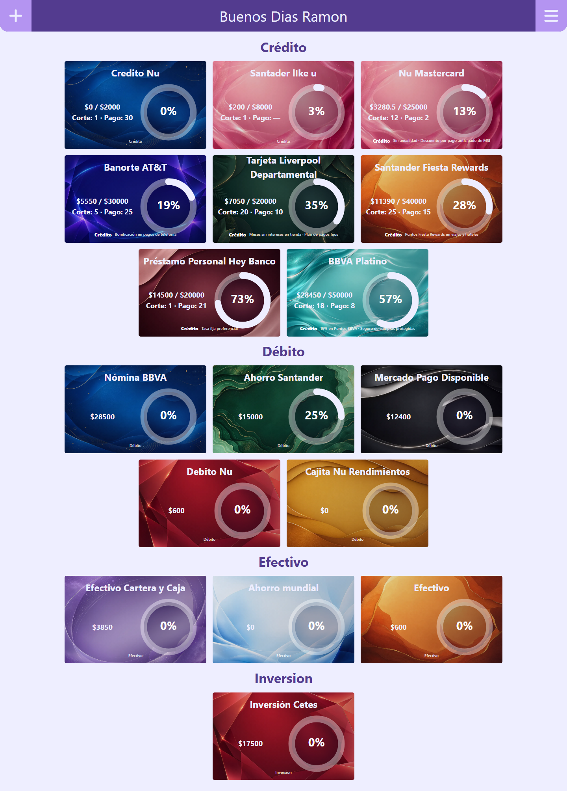
- **UI-CTA-2 🟡** La página no tiene encabezado, subtotales ni botón "Agregar cuenta". El título "Inversion" va sin tilde. Las cuentas de débito sin meta muestran un anillo "0%". El texto blanco sobre celeste tiene bajo contraste. Las tarjetas de crédito se ordenan de menor a mayor deuda (`totalB - totalA` sobre saldos negativos) (`resumenCuentasUx.jsx:61-79`).
- **UI-CTA-3 🟠** Los gestos ocultos (Ctrl/Shift+clic, long-press) abren "enlace entre cuentas" sin pista visual ni alternativa por teclado. → Menú "⋯" por tarjeta con "Transferir desde/hacia".

### 3.5 Modales globales

- **UI-MOD-1 🟠 · Agregar cuenta.** Solo "Nombre" tiene etiqueta (ver `SelectForm`); los placeholders se cortan, los tres selects usan el mismo ícono de banco y el botón dice "Enviar". No pide saldo inicial ni límite, así que obliga a abrir otros dos modales después. No valida que el día de corte sea distinto del de pago (`agregarCuenta.jsx:60-190`). 
- **UI-MOD-2 🟠 · Modificar monto.** Los campos Saldo y Saldo MSI usan el ícono de persona. Guarda un "Ajuste de saldo" sin mostrar antes la diferencia. → "Se registrará un ajuste de −$X". 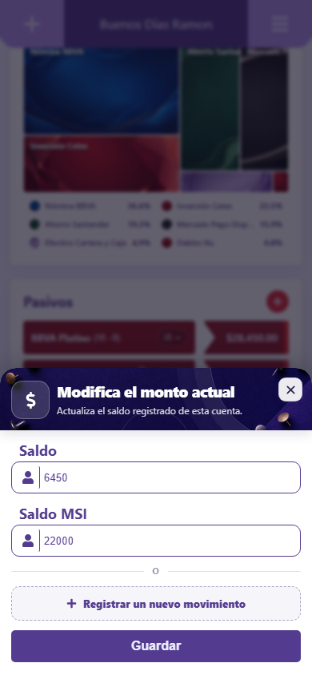
- **UI-MOD-3 🟡 · Nuevo movimiento, paso 1.** Los acordeones colapsados dejan ver unos 12 px del contenido.
- **L-MOD-4 🟠 · Gastos recurrentes pendientes.** `marcarPeriodoResuelto` se ejecuta **antes** de abrir "Agregar movimiento". Si el usuario cierra sin guardar, el gasto queda marcado y nunca se registra. → Marcarlo resuelto en el callback de éxito.

### 3.6 Movimientos `/movimientos`

- **UI-MOV-1 🔴 · 390.** El DataGrid solo muestra Fecha, Cuenta y Categoría cortada; **el monto** y las acciones quedan fuera, en un scroll horizontal sin indicación. Los filtros también se cortan. → Lista de tarjetas en móvil. 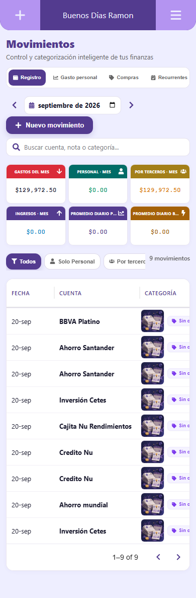
- **UI-MOV-2 🟠 · Estado vacío falso.** "No hay movimientos · $0.00" mientras se rehidrata la sesión (`loading` inicia en `false`; `paginaMovimientosUx.jsx:1684,1774`). 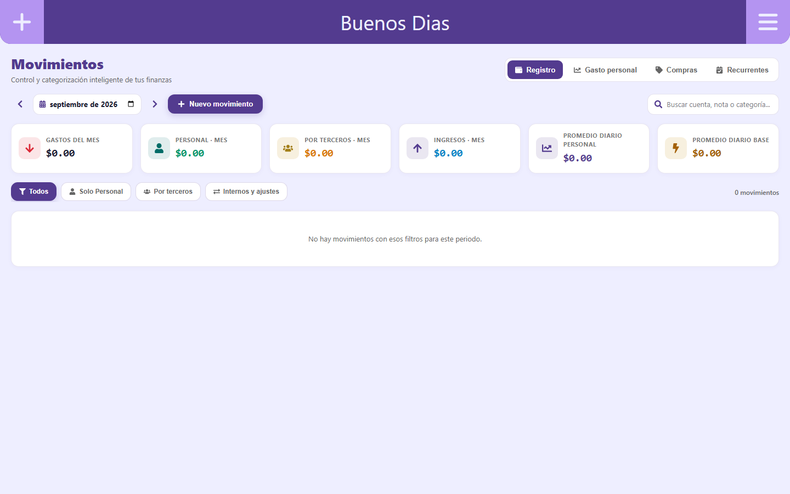
- **UI-MOV-3 🟡 · Análisis.** El switch Mensual/Anual se repite 4 veces, y su texto describe el estado actual en vez de la acción. El heatmap dice "en 2026-09" (ISO), las celdas vacías anteriores al día 1 tienen borde fuerte y los montos van a 8 px. 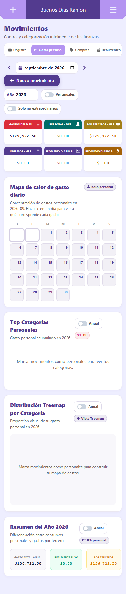
- **UI-MOV-4 🟡 · Cambiar categoría.** Son dos pasos (el modal tiene una tarjeta con otro dropdown). → Rejilla de categorías directa. 
- **L-MOV-5 🟡** Con el filtro "Todos", los movimientos internos se devuelven antes de aplicar la búsqueda (`:1911-1912`). `mismoMovimiento` compara solo por timestamp. El input de año del análisis consulta en cada tecla.

### 3.7 Ingresos `/ingresos`

- **UI-ING-1 🔴** "Exportar Matriz Resumen (CSV)" (modal Datos) lanza `empresas.map is not a function` y no descarga nada. `paginaIngresosUx.jsx:1207` pasa `(dataIngresos, year, prestamosPagos)` y la rama "objeto" de `exportarMatrizACSV` llama `calcularMatrizResumenMensual` con la firma equivocada. El botón de la propia matriz sí funciona.
- **UI-ING-2 🔴** El importador abre en "Histórico completo 2025 y 2026 (1 clic)", que carga los pagos personales fijos de Luis en cualquier cuenta sin confirmar (`modalImportarIngresos.jsx:132,137-156`). → Quitarlo o limitarlo al uid del dueño, y abrir en "Pegar desde Excel". 
- **UI-ING-3 🟠 · 390/768.** En la matriz y la pestaña de empresa, "TOTAL MES", "Pago real" y el total quedan fuera de la pantalla. → Sticky en las columnas Mes y Total, o acordeón por mes. 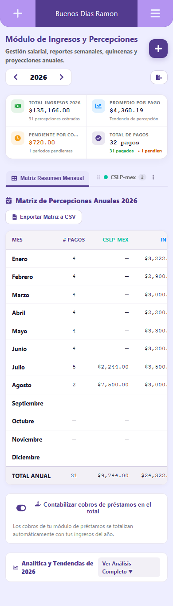 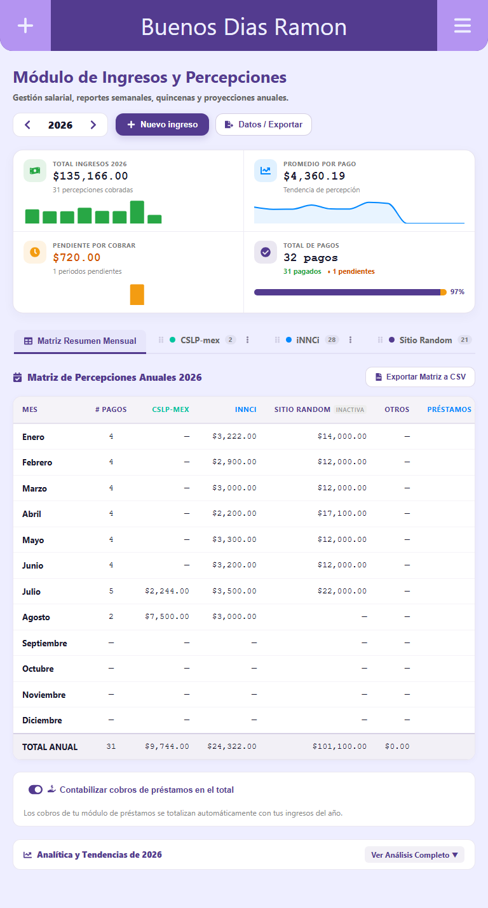
- **UI-ING-4 🟠** Las pestañas de empresas se desbordan sin pista. El ⋮ mide 19×19. Reordenar solo funciona con drag de ratón (no hay alternativa táctil ni de teclado). → "Mover ←/→" en el menú ⋮. 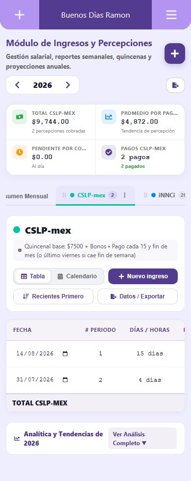
- **UI-ING-5 🟡** "Total de pagos" marca **100 %** con 0 pagos (`:1425,1437`). 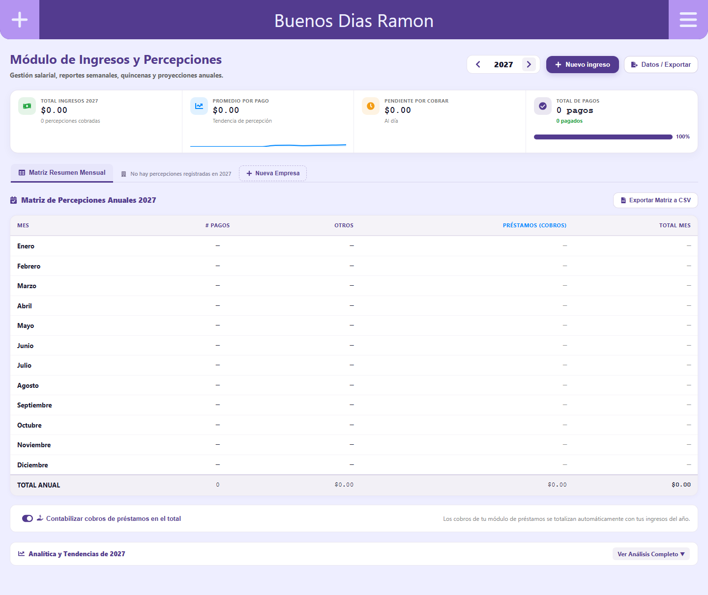
- **UI-ING-6 🟡 · Modal empresa.** Selects sin label y con doble borde; los ejemplos del select traen nombres reales ("ej. iNNCi", "$577/día") y se truncan (`modalEmpresa.jsx:98-100`); las notas van en un input de una línea; "Eliminar" queda pegado a "Guardar". 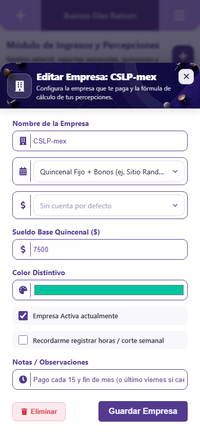
- **UI-ING-7 🟡** Algunas etiquetas de KPI se truncan en 390 ("PENDIENTE POR CO…", "• 1 pendien…").

### 3.8 Préstamos `/prestamos` (y `/cobranza`, que redirige aquí)

- **UI-PRE-1 🔴 · Recordatorios vencidos sin marca.** "Próximo pago: 21 ago 2026" aparece sin "Vencido" ni días de atraso. → Usar `calcularDiasAtraso`, insignia "Vencido · N días" y ordenar por urgencia. 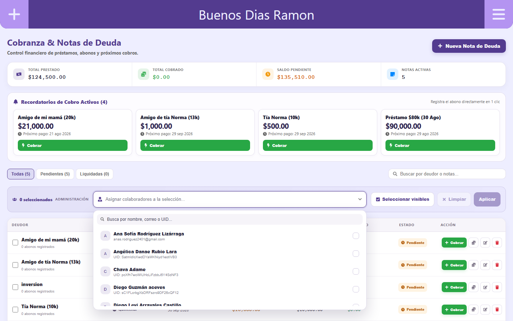
- **UI-PRE-2 🔴 · 390.** La tabla de 1120 px solo deja ver Deudor y Tipo. La página siempre pasa `modoTabla` (`paginaPrestamosUx.jsx:953`) aunque `CardNotaDeuda` ya tiene vista de tarjeta. 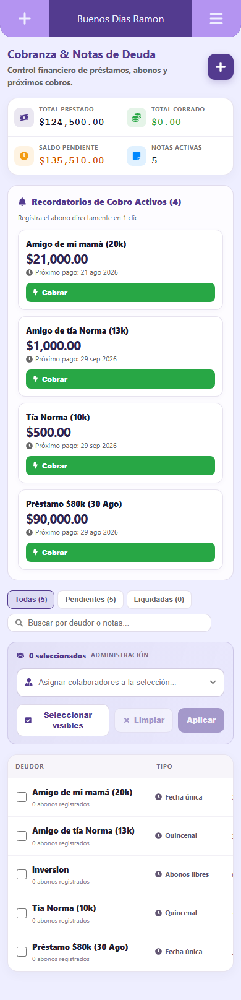
- **UI-PRE-3 🟠 · 768.** Hay scroll horizontal de página (`scrollWidth` 823): `BarraAdmin` solo pasa a una columna en ≤720 px (`:451-464`). 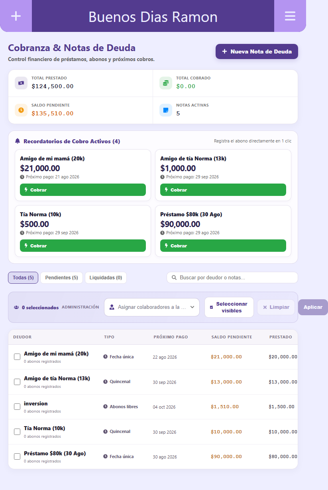
- **UI-PRE-4 🟠 · Editar préstamo.** La etiqueta dice "Interés estimado (%)" pero el valor se suma como **pesos** (`prestado + interesEstimado`). El préstamo "inversion" ($1,500 → saldo $1,510) sugiere que alguien capturó 10 pensando en %. El selector de periodicidad no tiene etiqueta y no hay botón Cancelar. 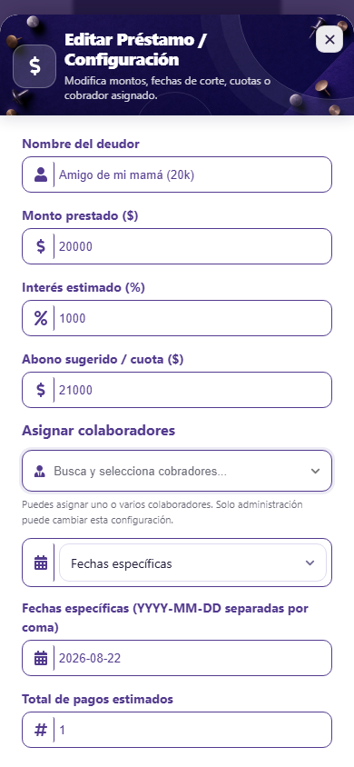
- **UI-PRE-5 🟠** El selector de colaboradores no cierra con Escape.
- **UI-PRE-6 🟡** Una búsqueda sin resultados muestra "No hay notas de deuda… Crear primera nota" aunque existen 5 notas. 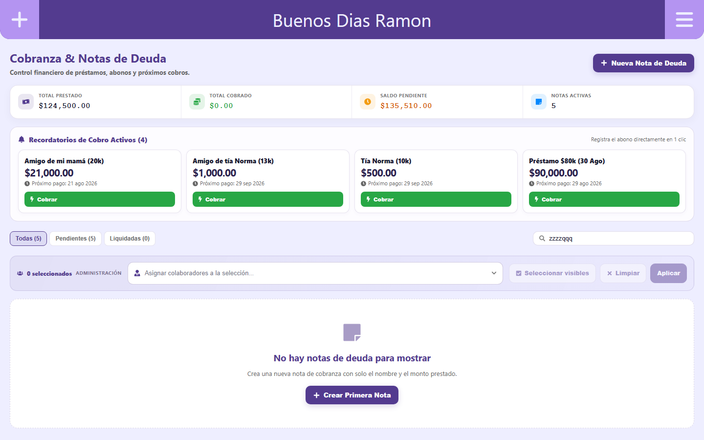

### 3.9 Ahorros `/ahorros`

- ✅ **Verificado:** la columna de gráficas queda a la derecha y sticky desde 981 px (a 1440 y 1024 px se mantiene en top=96 px mientras la tabla se desplaza) y a 980 px pasa a una columna.
- **UI-AHO-1 🔴** "Más análisis" abre con "No hay opciones disponibles", igual que el selector de categoría del modal "Desglosar incremento". Causa: `main.jsx:11` usa `StyleSheetManager shouldForwardProp={isPropValid}` y eso quita `options` a `styled(SelectVisual)` (`graficaHistorial.jsx:413,543`). Afecta también a `movimientos/comprasPlaneadas.jsx:443` y `gastosRecurrentes.jsx:373`. → En `shouldForwardProp`, reenviar todo cuando el destino no es una etiqueta HTML (`typeof target !== "string"`). 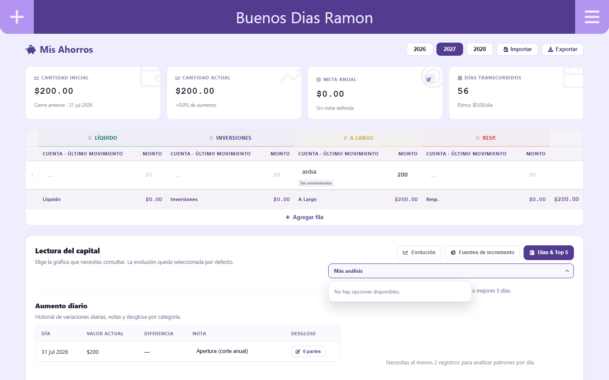 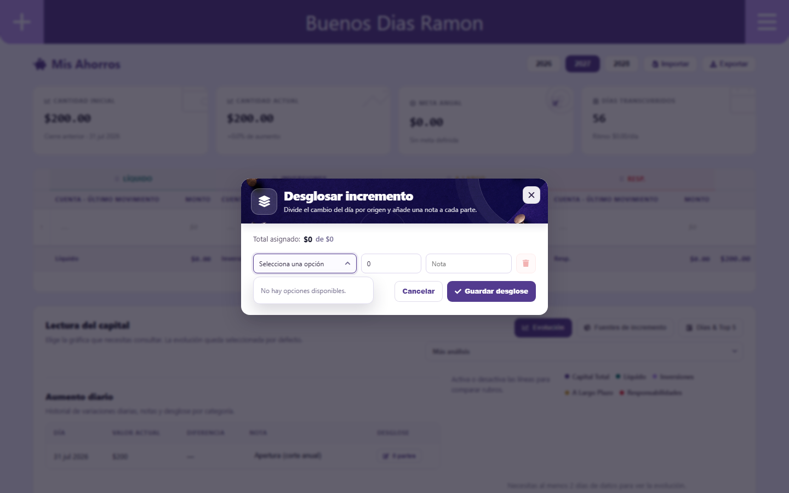
- **UI-AHO-2 🟠** La vista vacía ("Necesitas al menos 2 días…") deja unos 350 px en blanco. En móvil, la tabla de cuentas solo muestra "Líquido" y no indica que hay más columnas. 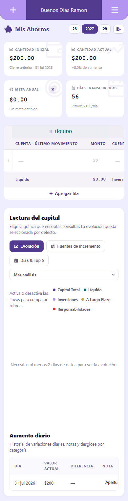
- **UI-AHO-3 🟡** Los botones de año muestran "26 / 2027 / 28" en móvil. El año de ahorro 2027 va de agosto de 2026 a julio de 2027 (`MES_CORTE=8`) sin explicarlo. → Subtítulo "Ago 2026 – Jul 2027".
- **UI-AHO-4 🟡** Solo la gráfica es sticky; el selector de vistas se va con el scroll, y con muchos datos aparece un scroll dentro de otro.

### 3.10 Despensa `/despensa`

- **UI-DES-1 🔴 · 390.** El menú de vistas se corta por el borde izquierdo ("ntario", "stica") porque usa `right:0` con el botón a la izquierda (`paginaDespensaUx.jsx:227-248`). 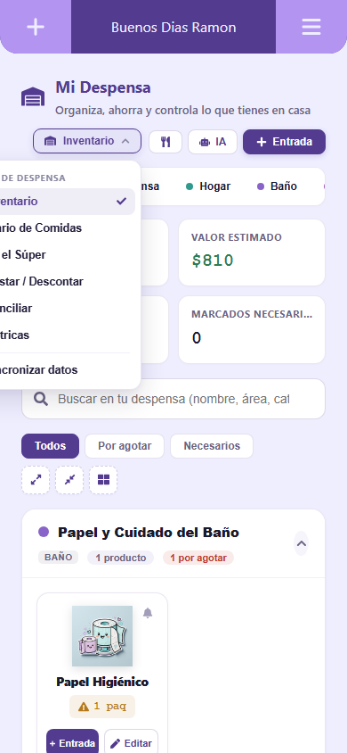
- **UI-DES-2 🟠** "Nivel de abasto" marca **100 %** con 19 de 33 productos "Por agotar" (`TabMetricas.jsx:385-390`). La gráfica de gasto mensual muestra un solo punto en $0 sin estado vacío. 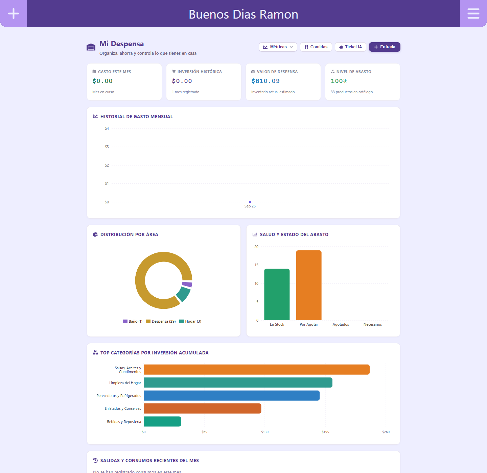
- **UI-DES-3 🟠 · 390.** En Conciliar, los nombres de producto se cortan a 130 px (15 nombres truncados). 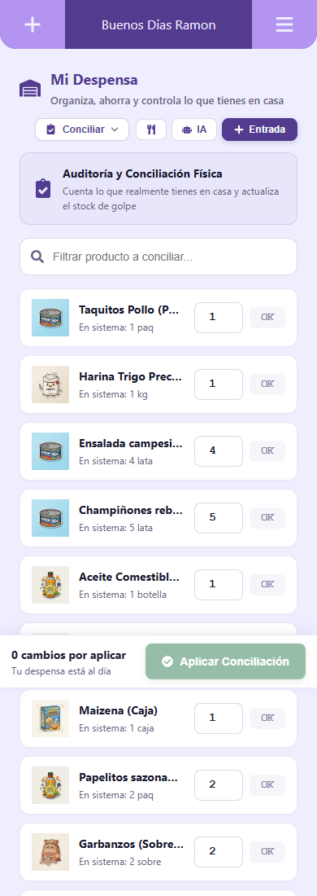
- **UI-DES-4 🟠 · 390.** La barra de áreas corta "Aseo Personal" sin pista de scroll; el KPI dice "MARCADOS NECESARI…". 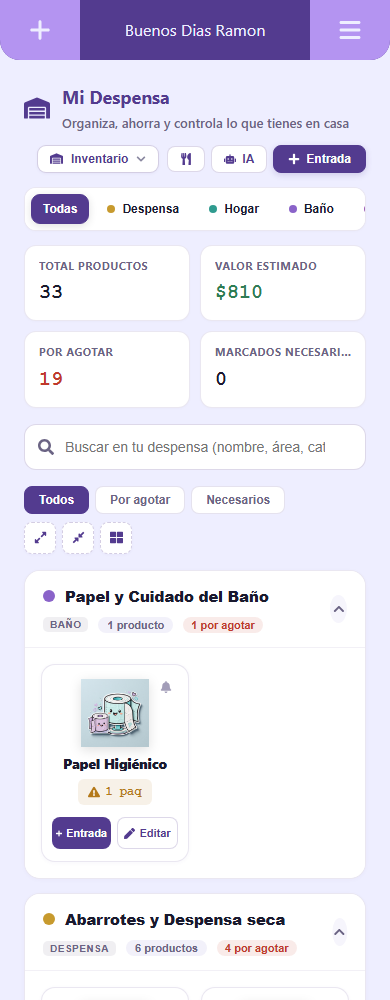
- **UI-DES-5 🟡** La altura de la cabecera cambia entre vistas (salto visual). Las 6 vistas principales quedan escondidas en un desplegable. → Segmented control o barra de pestañas fija.
- **UI-DES-6 🟡 · Comidas.** El botón dice "+ + Anotar lo que comí hoy" (`TabComidas.jsx:902`); la tarjeta dice "Mes actual" pero muestra el mes seleccionado; las fechas aparecen como ISO crudo; la sección se llama "Frecuentes" y el modal "Constantes". 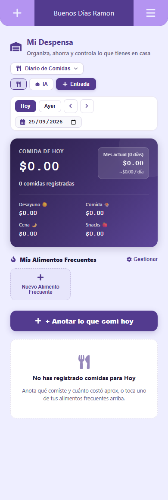
- **UI-DES-7 🟡** Las categorías se ordenan alfabéticamente y no según `ESTRUCTURA_AREAS`, aunque el comentario del código dice lo contrario (`TabInventario.jsx:646`).

### 3.11 Perfil `/perfil`

- **UI-PER-1 🔴** Al entrar directo o recargar, Google y Correo aparecen **"Sin vincular"** y se ofrecen para vincular; navegando dentro de la app salen "Vinculado". `cuenta` se inicializa con `auth.currentUser` antes de que la sesión se rehidrate (`perfil/index.jsx:370, 388-416`). Se ve ahora porque la corrección del refresco en `App.jsx` hace que la página cargue al entrar directo (antes se quedaba vacía). → Depender de `usuario?.uid` u `onAuthStateChanged` y mostrar un skeleton mientras `cuenta` es null. 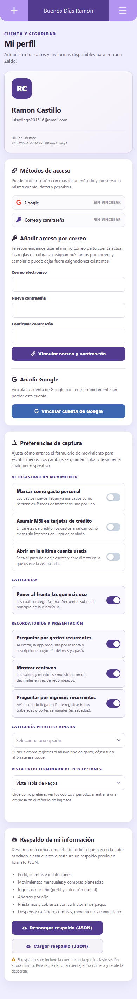 
- **UI-PER-2 🟡 · 1440.** La tarjeta del avatar se estira unos 620 px sin contenido. "Cargar respaldo" (la acción destructiva) tiene el mismo peso visual que "Descargar". Se muestra el UID completo. 

---

## 4. Lógica y flujos

| ID | Sev. | Problema | Impacto | Propuesta | Archivos |
|---|---|---|---|---|---|
| **L-1** | 🔴 | `formatearFilas` sobrescribe `categoria` con `normalizarCategoriaCompra()`, que devuelve `""` para `ajusteDeSaldo`, `ajusteDeSaldoMSI`, `transferencia`, `pagoTarjeta` e `ingreso` | Esos movimientos cuentan como **gasto** (septiembre: $129,972 de "gastos" que son ajustes). Al guardar desde el modal de categoría o de edición se escribe `categoria:""` y el tipo original se pierde | Conservar la categoría cruda para clasificar; normalizar solo para la imagen o etiqueta | `paginaMovimientosUx.jsx:134,143` |
| **L-2** | 🔴 | Migraciones y datos semilla fijos, ejecutados en el render según email ("luisarraca"/"luisydiego") **o `admin`**: `cargarHistoricosEnFirestore` + `aplicarAjusteInnciAgosto2026` (ingresos), `sincronizarPrestamosIniciales` (préstamos), `debeAgruparAtun` (despensa, que sobrescribe precios con valores fijos y reescribe el catálogo sin merge) | Cualquier admin recibe datos ajenos; lo borrado reaparece; se pueden pisar precios y cambios hechos desde otro dispositivo | Sacarlas del render a migraciones únicas con bandera (`perfil.migraciones.x = true`); quitar los datos personales del bundle; nunca tocar precios que ya existan | `paginaIngresosUx.jsx:914-926`, `paginaPrestamosUx.jsx:549-554`, `despensa.js:2188-2220,2479`, `datosHistoricosIngresos.js` |
| **L-3** | 🔴 | Borrar una comida: "Cancelar" en el `window.confirm` significa "no reponer inventario", pero la comida **se borra igual**; si no descontó inventario, se borra sin confirmar | Pérdida de datos accidental | Diálogo con tres opciones: Cancelar / Borrar / Borrar y reponer | `TabComidas.jsx:742-753` |
| **L-4** | 🔴 | Restaurar respaldo: no muestra fecha, origen ni volumen; acepta respaldos de otra cuenta; `merge:true` **reemplaza** arrays (comidas, movimientos del mes); lotes no atómicos; escribe claves desconocidas; no limpia la caché de despensa | Pérdida de lo registrado después del respaldo | Vista previa con metadatos, respaldo automático previo, escribir "RESTAURAR" para confirmar, lista blanca de rutas, aviso si el uid no coincide, `limpiarDespensa` | `respaldo.js:217-345`, `perfil/index.jsx:627` |
| **L-5** | 🔴 | Fechas en UTC: `new Date().toISOString().split("T")[0]` y `new Date("YYYY-MM-DD")` | Después de las 18:00 (UTC−6) la fecha por defecto es mañana; recordatorios y tabla difieren en un día | Utilidades únicas `hoyLocalISO()` y `parseFechaLocal()` (ya existen `fechaLocalISO` y `parseFechaLocal`; reutilizarlas en toda la app) | `modalNuevoIngreso.jsx:424,581,589`, `modalCrearNotaDeuda.jsx:191`, `modalRegistrarAbono.jsx:193,209`, `paginaPrestamosUx.jsx:636,645,838` |
| **L-6** | 🟠 | Consultar un año crea su documento (`obtenerOAInicializarIngresosAnio`, `obtenerOAInicializarAnio`); `/perfil` escribe el perfil en cada visita; ahorros repara aperturas al cargar | Documentos basura y escrituras innecesarias | Leer sin crear; crear con la primera escritura real; escribir el perfil solo si hay diferencias | `ingresos.js`, `ahorros.js`, `perfil/index.jsx:403` |
| **L-7** | 🟠 | `ModalNuevoIngreso` guarda en el documento del año visto aunque la fecha sea de otro año | El registro "desaparece" de la vista | Guardar en el documento del año de la fecha | `modalNuevoIngreso.jsx:606` |
| **L-8** | 🟠 | Edición inline en ingresos: el `input date` guarda en cada `onChange` (fechas intermedias como 0002-…), el monto guarda en cada blur aunque no cambie, acepta negativos, no recalcula `mes` y solo registra errores en consola | Escrituras corruptas o de sobra | Guardar en blur o Enter solo si cambió; validar; toast de error | `tablaEmpresaPagos.jsx:1127` |
| **L-9** | 🔴 | `agregarPago` arma el pago **sin `notas`** aunque el modal las envía | La referencia del abono se pierde en silencio | Incluir `notas`; marcar `estado:"pagado"` al liquidar | `firebase/prestamos.js:259-290` |
| **L-10** | 🔴 | La página pasa `onPrestamoModificado` y el modal llama `onPrestamoActualizado` | Editar u ocultar no refresca la tabla ni la caché | Unificar el nombre de la prop y filtrar `activo:false` | `paginaPrestamosUx.jsx:1006`, `modalEditarPrestamo.jsx:105` |
| **L-11** | 🟠 | Un cobrador asignado lee `prestamos/{suPropioUid}` y no la colección del dueño | La asignación masiva se guarda, pero el cobrador nunca ve los préstamos | Guardar `ownerUid` en la asignación o usar una colección índice; alinear con `firestore.rules` | `firebase/prestamos.js:203`, `firestore.rules` |
| **L-12** | 🟠 | Sincronía Ingresos↔Movimientos: solo el modal crea el movimiento; marcar "Pagado" desde la tabla, editar el monto o volver a "Pendiente" no actualiza nada | Saldos de cuentas desalineados con los ingresos | Servicio único, con `movimientoId` enlazado en el registro | `modalNuevoIngreso.jsx`, `tablaEmpresaPagos.jsx` |
| **L-13** | 🟠 | Despensa: filtros de productos activos inconsistentes (`activo !== false` contra `!prod.activo`); tres fórmulas distintas para el valor del inventario; `stockMinimo \|\| 1` y la comparación `<=` marcan como "por agotar" cualquier producto con 1 unidad; se suman unidades distintas; Gastar convierte 0 en 1 y permite stock negativo; marcar "necesario" no actualiza la caché | Cifras que no cuadran y señales sin valor | Selectores compartidos `productosActivos()` y `derivarInventario()`, `??` y `<`, validar contra el stock, actualizar la caché en cada escritura, TTL o revalidación | `TabGastar.jsx:423`, `TabInventario.jsx`, `TabMetricas.jsx`, `paginaDespensaUx.jsx:669-690` |
| **L-14** | 🟠 | Compras del súper registradas una por una en un bucle; el carrito vive en estado local | Si una compra falla, las anteriores ya quedaron escritas sin refrescar la pantalla; al cambiar de vista se pierde el carrito | Lote atómico (como ya hace el import IA); carrito en store o `sessionStorage` | `paginaDespensaUx.jsx:618-636` |
| **L-15** | 🟠 | Préstamos: el abono acepta montos mayores al saldo; el formulario de crear no se reinicia; interés solo en "Fecha única"; fechas específicas en texto libre; los recordatorios ignoran la frecuencia semanal y `diasMes`; cuota fija de $500 y chip "$500" solo si el préstamo es de $10,000 | Datos inconsistentes y recordatorios erróneos | Avisar si el abono excede el saldo; reiniciar al cerrar; interés con selector %/$; date picker; reutilizar `obtenerProximoPago` | `modalRegistrarAbono.jsx:311`, `modalEditarPrestamo.jsx:164`, `paginaPrestamosUx.jsx:651` |
| **L-16** | 🟠 | Errores convertidos en `[]` (`obtenerTodosPrestamos`, comidas, historial de métricas) | "No hay datos" cuando en realidad falló la red | Estado de error con "Reintentar" | varios |
| **L-17** | 🟡 | La matriz de ingresos suma pagos de préstamo filtrando solo por mes, **sin año** | Cobros de otros años se mezclan en el año visto | Filtrar por año | `ingresosCalculos.js` (`calcularMatrizResumenMensual`) |
| **L-18** | 🟡 | Las empresas sin registros en el año se ocultan de las pestañas | Una empresa recién creada "desaparece"; en un año nuevo no hay desde dónde proyectar periodos | Mostrar todas las empresas activas | `paginaIngresosUx.jsx` |

### Deuda técnica

- **T-1 🟠 · Imports con mayúsculas distintas.** Git registra `componentes/Modales/ModalGenerico.jsx`, pero 21 archivos importan `modales/modalGenerico`. También `./homeUx` contra `HomeUx.jsx`, `./secciones/seccionResumenes` contra `SeccionResumenes.jsx` y `cardCuenta` contra `CardCuenta.jsx`. Git tiene `core.ignorecase=true`. → Unificar con `git mv` y validar con un build en Linux o en WSL.
- **T-2 🟡 · Archivos gigantes.** `paginaMovimientosUx.jsx` (~3250 líneas: unas 1680 de estilos, 4 vistas y 4 modales, más de 20 `useState`), `paginaIngresosUx.jsx` (~1700), `tablaEmpresaPagos.jsx` (~1280). → Separar `estilos.js`, hooks `useMovimientosMes` y `useIngresosAnio`, y componentes por vista.
- **T-3 🟡 · Código muerto.** `cardOrdenCobro.jsx` y `modalNuevoPrestamoCobranza.jsx` no se importan en ningún lado.
- **T-4 🟡 · `App.jsx` `key={location.pathname}`.** Remonta cada página en cada navegación. Con las cachés del store ya no provoca lecturas repetidas, pero sí reinicia el estado local (filtros, carrito del súper).

---

## 5. Métricas que propongo agregar

**Primero hay que corregir las métricas actuales que muestran cifras incorrectas, porque una métrica errónea resta más confianza de la que aporta una nueva:** gastos inflados por ajustes (L-1), Activos/Pasivos incoherentes (UI-HOME-2), "Nivel de abasto 100 %" (UI-DES-2), "Total de pagos 100 %" con 0 pagos (UI-ING-5) y "Saldo pendiente > Total prestado" sin explicar que incluye intereses.

Métricas nuevas, ordenadas por valor y por qué tan fácil es calcularlas con los datos que la app ya tiene:

| # | Métrica | Cálculo | Por qué importa | Dónde | Datos disponibles |
|---|---|---|---|---|---|
| 1 | **Tasa de ahorro mensual** | (ingresos cobrados − gastos reales) / ingresos cobrados | Es el indicador de salud financiera más directo; une Ingresos y Movimientos, que hoy están aislados | Home | ✅ ingresos + movimientos (requiere L-1) |
| 2 | **Patrimonio neto y su tendencia** | Σ activos − Σ pasivos, serie mensual | Cuenta si el usuario va mejor o peor que el mes pasado, más allá de la foto del día | Home (sparkline) | 🟡 hay que guardar un snapshot mensual de saldos (ahorros ya lo hace por cuenta) |
| 3 | **Utilización de crédito** | saldo / límite por tarjeta y total | Arriba de 30 % afecta el buró; hoy el dato existe ("$3,280.5 / $25,000") pero no se interpreta | Cuentas / Home | ✅ |
| 4 | **Pago para no generar intereses y días al próximo pago** | saldo al corte − MSI no vencidos; días hasta `diaPago` | Evita intereses y recargos; es la alerta más accionable | Home (banner) / Cuentas | ✅ día de corte y pago + saldo MSI |
| 5 | **MSI comprometidos a futuro** | Σ mensualidades MSI por mes siguiente | Muestra cuánto ingreso futuro ya está comprometido | Cuentas / Movimientos | 🟡 depende de cómo se registren los MSI |
| 6 | **Fondo de emergencia (meses cubiertos)** | ahorro líquido / gasto promedio de 3 meses | Meta clásica de 3 a 6 meses; da propósito a la sección Ahorros | Ahorros / Home | ✅ ahorros (Líquido) + movimientos |
| 7 | **Gasto fijo contra variable** | gastos recurrentes / gasto total | Muestra cuánto margen real hay para recortar | Movimientos → Análisis | ✅ recurrentes |
| 8 | **Flujo de caja proyectado a 30 días** | saldo líquido + ingresos pendientes + cobros de préstamos esperados − recurrentes − pagos de tarjeta | Anticipa quedarse sin liquidez antes de que pase | Home | ✅ todo existe en distintos módulos |
| 9 | **Cartera de préstamos: vencida y recuperación** | monto vencido y días de atraso (0-30/31-60/60+), % recuperado, intereses cobrados | Convierte la lista de préstamos en gestión de cobranza | Préstamos (KPIs) | ✅ `calcularDiasAtraso` ya existe |
| 10 | **Concentración de ingresos** | % del ingreso anual por empresa/cliente | Mide la dependencia de un solo cliente (riesgo) | Ingresos → Analítica | ✅ |
| 11 | **Ingreso efectivo por hora** | cobrado / horas reportadas, por empresa | Compara qué cliente paga mejor en realidad | Ingresos (por horas) | ✅ `horasReportadas` |
| 12 | **Inflación personal de despensa** | variación de precio ponderada de la canasta habitual contra 3 y 12 meses | Ya existe el "análisis de incrementos"; esta métrica lo resume en un solo número | Despensa → Métricas | ✅ historial de precios |
| 13 | **Costo por día de comida y merma** | gasto de despensa / días; productos que caducaron o se ajustaron en Conciliar | Conecta Súper, Comidas y Conciliar | Despensa → Métricas | 🟡 depende del registro de consumos |

**Recomendación:** empezar por 1, 3, 4 y 6. Son las más accionables y no necesitan nuevos datos. La 2 y la 8 son las de mayor impacto, pero necesitan guardar snapshots mensuales o combinar varios módulos.

---

## 6. Lo que está bien (no romper)

- No hay scroll horizontal de página en ninguna ruta salvo `/prestamos` a 768 px.
- `ModalGenerico`: hoja inferior en móvil, centrado en escritorio, bloquea el scroll del body, cierra con Escape, `role="dialog"` y `aria-modal`.
- Las gráficas usan `ResponsiveContainer` sin anchos fijos. Las tablas financieras usan el patrón wrapper con `overflow-x` + `min-width`.
- El sticky de gráficas en `/ahorros` funciona desde 981 px y pasa a una columna a 980 px.
- El drawer tiene `aria-current` y devuelve el foco a "☰" al cerrarse. El treemap y el heatmap son operables por teclado. Los switches tienen `role="switch"`.
- Los flujos de 2 pasos (Nuevo movimiento, Súper y Gastar) son claros; el modal Ticket IA está bien guiado.
- Hay confirmaciones antes de eliminar o archivar en instituciones, compras, recurrentes y préstamos.
- Las preferencias de vista se guardan en `localStorage` con try/catch. La reautenticación en perfil reintenta la operación pendiente.
- Las cachés por mes (movimientos), por año (ahorros) y de despensa hacen instantánea la navegación entre vistas ya cargadas.

---

## 7. Plan sugerido

1. **Sprint 1 — Integridad de datos (🔴 lógica):** L-1, L-3, L-5, L-9, L-10, UI-ING-1, UI-ING-2, UI-AHO-1 (cambio de una línea en `main.jsx`), UI-PER-1, T-1.
2. **Sprint 2 — Migraciones y respaldo:** L-2 (sacar migraciones del render, con banderas), L-4 (restaurar seguro), L-6, L-7, L-8.
3. **Sprint 3 — Móvil:** token de área táctil, focus-trap en `ModalGenerico`, `SelectForm` con label, vistas de tarjeta para movimientos y préstamos, sticky de columnas en la matriz de ingresos, `ScrollChips`, login en registro, menú de despensa.
4. **Sprint 4 — Métricas:** corregir las métricas actuales y agregar las métricas 1, 3, 4 y 6.
5. **Continuo:** partir los archivos gigantes (T-2), borrar el código muerto (T-3) y los hallazgos 🟡.
